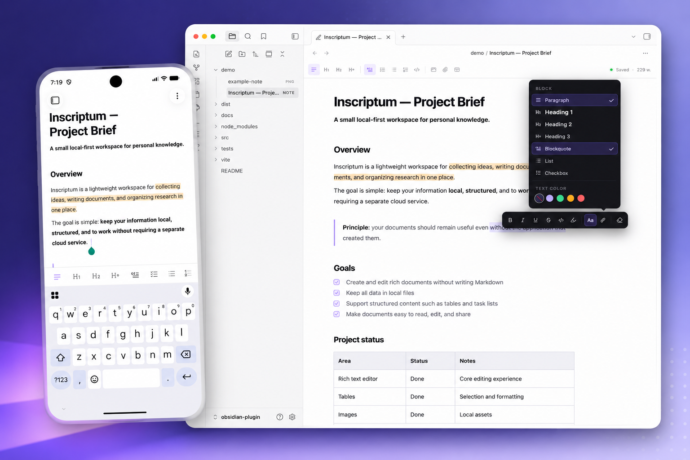

# Inscriptum — local-first rich text editor

[](https://community.obsidian.md/plugins/inscriptum)
[](https://github.com/inscriptum/obsidian-plugin/releases/latest)
[](LICENSE)

**A comfortable WYSIWYG editor for creating structured documents.**

Inscriptum lets you create and edit rich documents without having to write Markdown.

Write structured documents with headings, lists, todo items, tables, images, links, code blocks, and more — using a familiar visual editor.

Your documents stay **local and under your control**. No cloud storage, no account, and no lock-in.



The Obsidian plugin brings Inscriptum to your Obsidian vault, allowing you to use the editor alongside your existing notes and workflow.

## Features

* WYSIWYG rich text editing
* Headings and structured documents
* Todo lists and regular lists
* Blockquotes
* Tables with cell selection and styling
* Images
* Links and automatic URL/email linking
* Code blocks with syntax highlighting
* Switchable syntax highlighting themes
* Bubble menu for quick formatting

## Local-first

Inscriptum keeps your documents in your Obsidian vault.

There is no cloud service, no account, and no external storage required. Your documents and data remain on your device and under your control.

## Installation

### Via Community Plugins (recommended)

1. Open **Settings → Community plugins** in Obsidian.
2. Disable Restricted mode if it is on.
3. Click **Browse** and search for **Inscriptum**.
4. Install and enable it.

Alternatively, open the plugin page directly: [Inscriptum on Obsidian Plugins](https://community.obsidian.md/plugins/inscriptum).

### Via BRAT

If you want to try the latest development versions before they are released, install Inscriptum using [BRAT](https://obsidian.md/plugins?id=obsidian42-brat).

1. Install **BRAT** in Obsidian.

2. Open **BRAT → Add Beta Plugin**.

3. Add:

   `inscriptum/obsidian-plugin`

4. Install and enable **Inscriptum**.

### Manually

1. Download `main.js`, `manifest.json`, and `styles.css` from the [latest release](https://github.com/inscriptum/obsidian-plugin/releases).
2. Create the plugin directory:

   `.obsidian/plugins/inscriptum/`
3. Copy the downloaded files into it.
4. Reload Obsidian.
5. Enable **Inscriptum** under **Settings → Community plugins**.

## Development

Clone the repository and install dependencies:

```bash
git clone https://github.com/inscriptum/obsidian-plugin.git
cd obsidian-plugin
npm ci
```

Start the development build:

```bash
npm run dev
```

The development build runs in watch mode and automatically deploys the plugin to:

```text
.obsidian/plugins/inscriptum/
```

Create a production build:

```bash
npm run build
```

Run tests:

```bash
npm test
```

## Release

Releases are built automatically by GitHub Actions.

Create a new version and push the tag:

```bash
npm version patch
git push --follow-tags
```

The workflow builds the plugin, takes the release notes for the new version
from [CHANGELOG.md](CHANGELOG.md), and publishes the release automatically.

Before pushing the tag, add a `## [x.y.z]` section to CHANGELOG.md describing
the changes — the release will be created only if that section exists.

## License

MIT © 2026 sumbad
